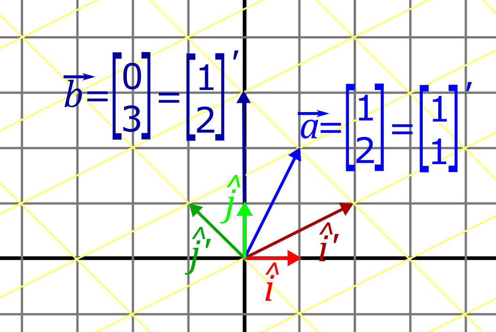
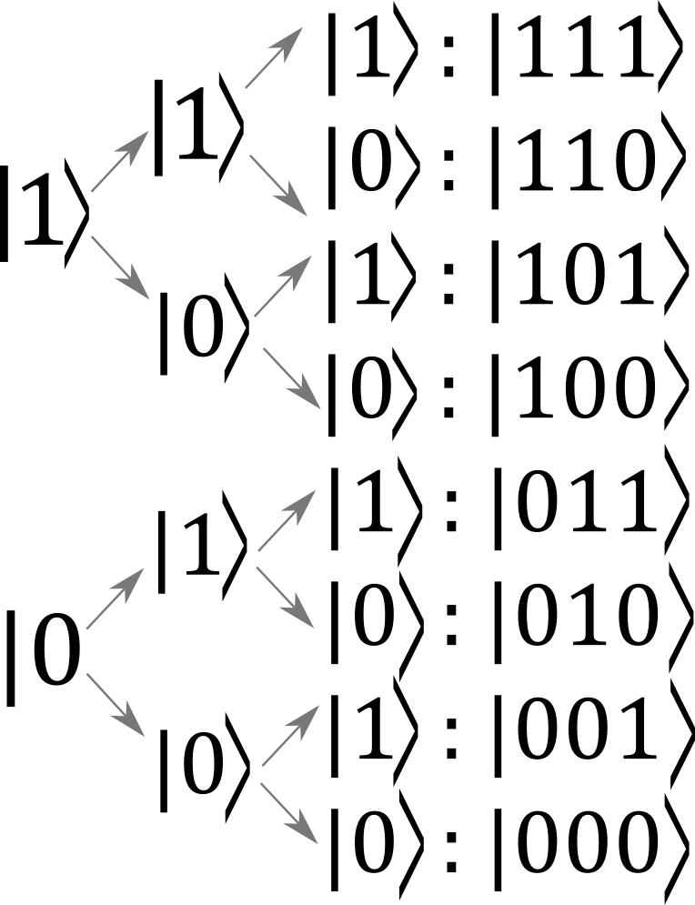
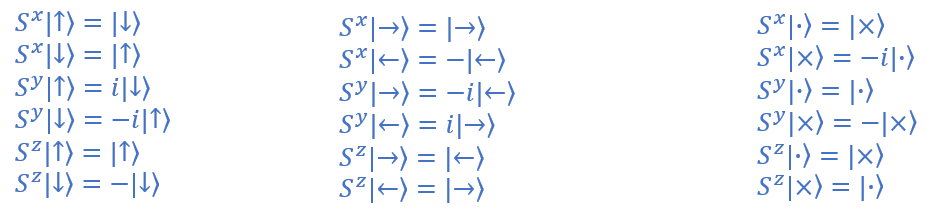
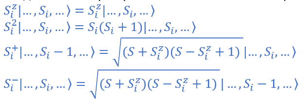
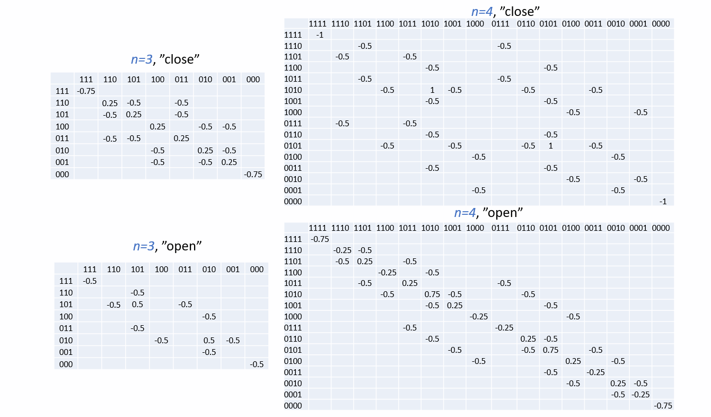
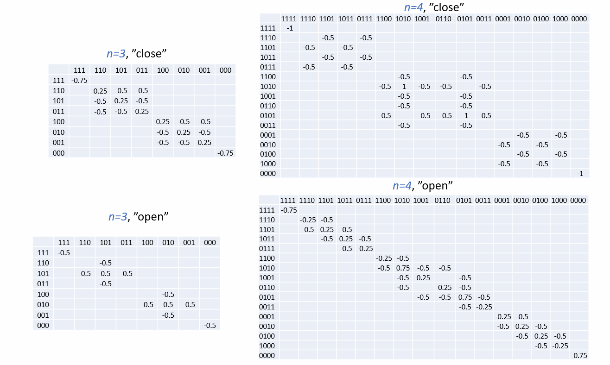
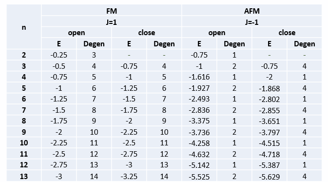
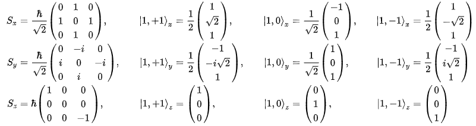
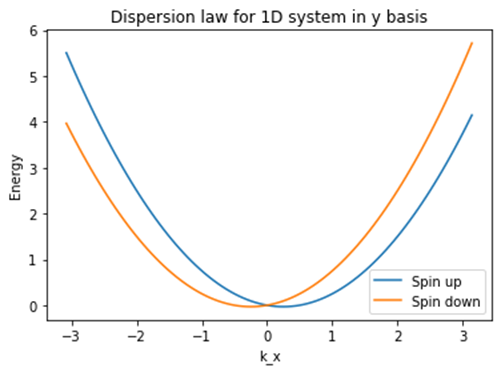
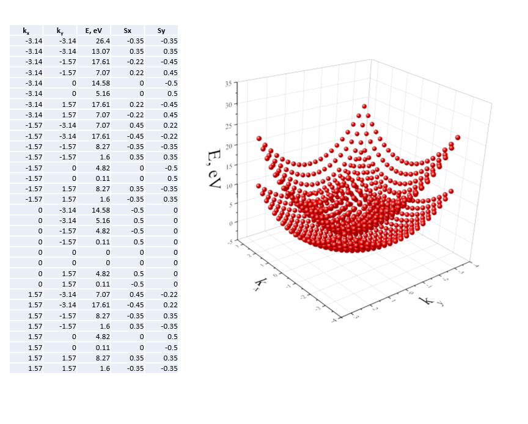

Simulation of quantum spin systems
========================================

.. raw:: html

    

.. role:: red

Linear Algebra basics
---------------------------------------

Matrix-vector multiplication as change of basis
~~~~~~~~~~~~~~~~~~~~~~~~~~~~~~~~~~~~~~~~~~~~~~~~~~

A vector :math:`\vec{x} = \begin{bmatrix} 1\\ 2 \end{bmatrix}` is written in the basis of :math:`\hat{i}` and :math:`\hat{j}`, where :math:`\hat{i} = \begin{bmatrix} 1\\ 0 \end{bmatrix}` and :math:`\hat{j} = \begin{bmatrix} 0\\ 1 \end{bmatrix}`. Matrix multiplication with the matrix :math:`A = \begin{bmatrix} 2 & -1\\ 1 & 1 \end{bmatrix}` results in the vector :math:`\vec{y} = \begin{bmatrix} 0\\ 3 \end{bmatrix}` in the basis of :math:`\hat{i}` and :math:`\hat{j}`. This vector can also be written as :math:`\vec{y} = \begin{bmatrix} 1\\ 2 \end{bmatrix}` in the new basis of :math:`\hat{i}~' = \begin{bmatrix} 2\\ 1 \end{bmatrix}` and :math:`\hat{j}~' = \begin{bmatrix} -1\\ 1 \end{bmatrix}`.

.. math::
   
	A\vec{x} = \vec{y} = \begin{bmatrix}
      a_{11} & a_{12}\\
      a_{21} & a_{22}
   \end{bmatrix} \begin{bmatrix}
      x_i\\
      x_j
   \end{bmatrix} = x_i \begin{bmatrix}
      a_{11}\\
      a_{21}
   \end{bmatrix} + x_j \begin{bmatrix}
      a_{12}\\
      a_{22}
   \end{bmatrix} = \begin{bmatrix}
      x_i a_{11} + x_j a_{12} \\
      x_i a_{21} + x_j a_{22}
   \end{bmatrix}

.. sidebar:: Example

	.. math::

	   \begin{bmatrix}
		 2 & -1\\
		 1 & 1
	   \end{bmatrix} \begin{bmatrix}
		  1 \\
		  2 
	   \end{bmatrix} =  \begin{bmatrix}
		  0 \\
		  3 
	   \end{bmatrix} \\

       Figure 1. Multiplication of a matrix by a vector leads to a change in its coordinate basis

.. sidebar:: Examples

	.. math::

	   \begin{bmatrix}
		  2 & -1\\
		  1 & 1
	   \end{bmatrix} ^{-1}\begin{bmatrix}
		  0 \\
		  3 
	   \end{bmatrix} =  \begin{bmatrix}
		  1 \\
		  2 
	   \end{bmatrix} \\
	   \begin{bmatrix}
		  2 & -1\\
		  1 & 1
	   \end{bmatrix} ^{-1}\begin{bmatrix}
		  1 \\
		  2 
	   \end{bmatrix} =  \begin{bmatrix}
		  1 \\
		  1 
	   \end{bmatrix}' \\
	   
If we know the result of the application of the matrix :math:`A` on the original vector :math:`\vec{x}`, then the original vector can be obtained by multiplying the result :math:`\vec{y}` by the inverse matrix :math:`A^{-1}`:

.. math::
   
	A\vec{x} = \vec{y} \Rightarrow A^{-1}A\vec{x} = A^{-1}y \\
	x = A^{-1}y

If we want to know how the vector :math:`\vec{x}` will be written in a new basis :math:`A`, then we need to multiply this vector by the inverse matrix:

.. math::
  
	A^{-1}\vec{x} = \vec{x}~'

.. code-block:: python

	import numpy as np
	
	a = np.array([[2, -1], [1, 1]])
	b = np.array([[1], [2]])
	c = a @ b
	d = np.linalg.inv(a) @ c
	e = np.linalg.inv(a) @ b
	print(c, d, e)
 
:**Determinant of the matrix**: The area formed by the vectors (columns) of the matrix, taking into account the sign. When these vectors are parallel (linearly dependent), then the determinant will be zero.

:**Dot product of vectors**: The projection of the first vector on to the second, multiplied by the length of the second. This operation is commutative, meaning that the order of vectors does not make a difference.

:**Orthogonality of vectors**: Two vectors are orthogonal if their dot product is zero.

:**Commutativity of matrices**: Two matrices are commutative if :math:`AB = BA`.

.. rubric:: Helpful rules

#. If 2 vectors :math:`\vec{x}` and :math:`\vec{y}` are orthogonal and vectors (columns) of the matrix :math:`A` are orthogonal, then the result of the vector transformation :math:`A\vec{x}` and :math:`A\vec{y}` is orthogonal too. 

#. A matrix with a size :math:`a \times b` converts a vector with length :math:`b` into a vector with length :math:`a`. For example a :math:`2 \times 3` matrix converts a 3-line vector to a 2-line vector.
 
#. If a set of vectors is given in the form of a matrix :math:`M`, then the same set :math:`M'` in a new basis can be obtained using the following transformation:

.. math::
  
	A^{-1}MA = M'
	
4. The reverse transition can be done as follows:

.. math::

	AM'A^{-1} = M

.. seealso:: I recommend the `visual short course on linear algebra`_.

.. _`visual short course on linear algebra`: https://youtube.com/playlist?list=PLZHQObOWTQDPD3MizzM2xVFitgF8hE_ab

Eigenvalues and eigenvectors
~~~~~~~~~~~~~~~~~~~~~~~~~~~~~~~

Matrix definitions
~~~~~~~~~~~~~~~~~~~

:**Normal**:  matrix that commutes with its complex conjugate matrix :math:`AA^{\dagger}= A^{\dagger}A` .

:**Identity**:  matrix whose diagonal elements are equal to one, the rest are equal to zero. Multiplying a vector by the identity matrix does not result in any change.

:**Symmetrical**:  matrix symmetric about the main diagonal :math:`A_{ij}= A_{ji}`, or :math:`A^T= A`.

:**Inverse**:  the product of a matrix by its inverse matrix gives the identity matrix :math:`A^{-1}A= I`.

:**Hermitian**:  a matrix that does not change when all elements are transposed and complex conjugated. In physics, a Hamiltonian matrix :math:`\hat{H}` is hermitian.

:**Unitary**:  matrix whose product by its complex conjugate matrix gives the identity matrix :math:`AA^{\dagger}= I`, :math:`A^{\dagger}= A^{-1}`. THe evolution operator :math:`U= e^{-i\hat{H}t/\hbar}` is an example of this.

:**Special**:  matrix with zero determinant. This means that the vectors formed by the columns of the matrix are linearly dependent (parallel).

:**Orthogonal**:  matrix in which all columns are orthogonal vectors, and its inverse matrix is equal to the transposed :math:`A^{T}= A^{-1}`.

Properties of Hermitian and unitary matrices
~~~~~~~~~~~~~~~~~~~~~~~~~~~~~~~~~~~~~~~~~~~~~

.. rubric:: Properties of Hermitian matrices:

1. The eigenvalues of the Hermitian as well as the symmetric matrix are real numbers.

2. The eigenvectors of the Hermitian matrix corresponding to different eigenvalues are orthogonal. But if two different eigenvectors correspond to one eigenvalue, then they are not necessarily orthogonal to each other. But they are orthogonal to all other eigenvectors corresponding to other eigenvalues.

3. Diagonal elements are real numbers.

4. The real Hermitian matrix is symmetric.

5. Determinant of a Hermitian matrix - real number

6. Sum of two Hermitian matrices is an Hermitian matrix.

7. The product of two Hermitian matrices is a Hermitian matrix only if these matrices commute :math:`AB = BA`.

.. rubric:: Properties of unitary matrices:

1. Any unitary matrix is normal :math:`A A^{\dagger} = A^{\dagger} A= I`.

2. The transformation represented by the unitary matrix of the orthonormal basis preserves the orthonormality of the resulting basis.

3. The transformation represented by a unitary matrix preserves the dot product (and therefore the lengths of all vectors)

4. If the matrix :math:`A` is unitary, then you can find such a matrix :math:`S`, that its transformation diagonalizes the matrix :math:`S^{\dagger}AS = D`, where  :math:`D` is a diagonal matrix

5. The set of all unitary matrices forms a unitary group - a Lie group over the field of real numbers.

The concept of state in quantum mechanics
------------------------------------------
	   
In classical mechanics and electrodynamics, the description of a system usually begins with the definition of a coordinate system - the space in which objects move and electromagnetic fields propagate. In quantum mechanics, describing a system begins with identifying the possible states of the system. 

States of classic bits
~~~~~~~~~~~~~~~~~~~~~~~~~~~~~

Let's consider a simple example: a system of several spins. Spin is a quantum quantity with special properties, but at the moment we only care that it can be oriented up or down, like a coin that can be oriented heads or tails. The up state will be denoted by the up arrow or 1, and the down state will be denoted by the down arrow or 0. The state of the system will be shown using bracket notation. The contents of a bra (:math:`| \rangle`) and a ket (:math:`\langle |`) is always a system state.
Let us introduce a basis for several spins, in other words, define their possible states. For one spin, the number of available states is only 2 - up or down. Let us denote these states as :math:`|{\uparrow}\rangle` and :math:`|{\downarrow}\rangle`. For two spins, 4 states are possible in total: :math:`|{\uparrow\uparrow}\rangle`, :math:`|{\uparrow\downarrow}\rangle`, :math:`|{\downarrow\uparrow}\rangle` and  :math:`|{\downarrow\downarrow}\rangle`. The number of states  :math:`n` grows exponentially with increasing number of spins - :math:`n = 2^x`, where :math:`x` is the number of spins. The way of recording states for 3 spins is shown in Figure 2. Each of the numbers denotes the state of an individual spin.

       Figure 2. Formation of basis states.
  
Note that the resulting states correspond to the binary representation of the numbers 0 through 8. The number of states is called the Hilbert space of the system. To emphasize the dimensionality of our space, we can say that the microsystem in the state :math:`|{\psi}\rangle` belongs to the Hilbert space :math:`H`  of dimension :math:`n`:

.. math:: 
	:label: hilbert

	|{\psi}\rangle \in H^n

Now let us introduce the concept of the basis of the system. The basis is a set of states that can be used to fully describe the state of the system. For classical objects (for example, coins) the states introduced above (:math:`|{111}\rangle`, :math:`|{110}\rangle`, etc.) are a set of basis vectors. This is not the case for quantum objects, but before that we introduce a mathematical way of describing states using vectors. Each of the eight basis states (for 3 spins) will be denoted in the form of a column vector with one nonzero element:

.. math::

   |{\xi_1\rangle} = |{111}\rangle = \begin{bmatrix}
      1\\
      0\\
      0\\
      0\\
      0\\
      0\\
      0\\
      0
   \end{bmatrix},
   |{\xi_2\rangle} = |{110}\rangle = \begin{bmatrix}
      0\\
      1\\
      0\\
      0\\
      0\\
      0\\
      0\\
      0
   \end{bmatrix}
   
   
In the Python environment, you can form a set of basis vectors using the library ``NumPy``:

.. code-block:: python
	
	import numpy as np
	
	diag_basis = np.diag(np.ones(8))
  
Then the specific state is set by the selection of the column:

.. code-block:: python

	ksi_1 = diag_basis[:,0]
	ksi_2 = diag_basis[:,1]	

The state described by a column vector is denoted as :math:`|{110}\rangle`, and the transposed state is denoted as a row vector :math:`\langle{110}|`. To do this, the method is applied to the state ``.T``:

.. code-block:: python

	>>print(ksi_2.T)
	[0. 1. 0. 0. 0. 0. 0. 0.]

More details about bra and ket notation can be found in all good quantum mechanics textbooks. At the moment, it is important to know that bras and kets describe the state of the system, written in the form of a column vector (bra) or a row vector (ket). Now let's move on to quantum bits.

Properties of quantum states, terminology
~~~~~~~~~~~~~~~~~~~~~~~~~~~~~~~~~~~~~~~~~~~~

Before describing quantum states, let us describe some of their properties.

The most convenient way to describe a microsystem is **to use an orthogonoal basis** with dimension :math:`n`. Orthogonality means that :math:`\left\langle \xi_i \middle| \xi_j \right\rangle = \delta_{ij}`. The basis states used above for classical bits was orthonormal, since:

.. math::

   \left\langle \xi_1 \middle| \xi_2 \right\rangle = \begin{bmatrix} 0& 1 \end{bmatrix} \begin{bmatrix}
      1\\
      0
   \end{bmatrix} = 0, \\
   \left\langle \xi_1 \middle| \xi_1 \right\rangle = \begin{bmatrix} 1& 0 \end{bmatrix} \begin{bmatrix}
      1\\
      0
   \end{bmatrix} = 1.

Or the same in Python:

.. code-block:: python

	print(ksi_1.T @ ksi_2)
	print(ksi_1.T @ ksi_1)

When measured in this basis, the system can take one of these :math:`n` basic states. This is called reduction (or collapse) of the state.

**Pure states** can be represented as a superposition of basic states :math:`| \psi \rangle = c_1 | \xi_1 \rangle + c_2 | \xi_2 \rangle  + ... + c_n | \xi_n \rangle = \sum_{i=1}^n c_n | \xi_n \rangle`. 

.. sidebar:: An example of a quantum state
	
	vector :math:`\begin{bmatrix} c_1\\ с_2\\ c_3 \end{bmatrix}` describes a quantum state in three-dimensional Hilbert space if :math:`|с_1|^2 + |с_2|^2+ |c_3|^2=1`	

Let us multiply the pure state on the left :math:`| \psi \rangle`by :math:`\langle \xi_i |` and use the orthogonality property of the basis vectors:

.. math::

	\langle \xi_i| \psi \rangle = c_i \langle \xi_i | \xi_i \rangle = c_i 

The probability after a measurement to be in a state :math:`| \xi_i \rangle`: :math:`|c_i|^2 = \langle \xi_i | \psi \rangle \langle \psi | \xi_i \rangle`

Since the sum of the probabilities of all possible events must be equal to one, then :math:`\sum_{i=1}^n |c_i|^2 = 1`. 

.. literalinclude:: _static/probabilities_of_states.py
   :language: python	

The observed quantity corresponds to the Hermitian operator (matrix) :math:`\hat{A} = \hat{A} ^\dagger`.

.. sidebar:: An example of a quantum operator
	
	The matrix :math:`\begin{bmatrix} a_{11} & a_{12}\\ a_{21} & a_{22} \end{bmatrix}` is an operator if :math:`a_{12} = a_{21}^\dagger`	

The average value of the observable :math:`A` in the state :math:`|\psi \rangle`: :math:`\langle \hat{A} \rangle_{\psi} = \langle \psi | A | \psi \rangle`

The operator matrix element :math:`A_{ij} = \langle \xi_i | \hat{A} | \xi_j \rangle`.

The identity operator :math:`I = \sum_{i=1}^n | \xi_i \rangle \langle \xi_i |`. The action of a single operator does not change the wave function in any way.

Pauli matrices and Spin operators
-----------------------------------

Spin is the quantum characteristic of elementary particles. Consider particles with spin 1/2. Then, when measuring the spin projection, its value can be equal to +1/2 or -1/2 in units :math:`\hbar`.

The spin projection can be chosen along one of 3 axes, respectively, we can introduce 3 sets of states.

Basis along the :math:`z` axis: :math:`|\uparrow \rangle = \begin{bmatrix} 1\\ 0 \end{bmatrix}`, :math:`| \downarrow \rangle = \begin{bmatrix} 0\\ 1 \end{bmatrix}`

Basis along the :math:`x` axis: :math:`| \rightarrow \rangle = \begin{bmatrix} 0.707\\ 0.707 \end{bmatrix}`, :math:`| \leftarrow \rangle = \begin{bmatrix} 0.707\\ -0.707 \end{bmatrix}`

Basis along the :math:`y` axis: :math:`| \cdot \rangle = \begin{bmatrix} 0.707\\ 0.707i \end{bmatrix}`, :math:`| \times \rangle = \begin{bmatrix} 0.707\\ -0.707i \end{bmatrix}`

Each of these sets forms an orthogonal basis. These sets are eigenvectors of Pauli matrices with eigenvalues :math:`\pm1`:

.. math::
   \sigma_z = \begin{bmatrix} 1 & 0\\ 0 & -1\end{bmatrix}~
   \sigma_x = \begin{bmatrix} 0 & 1\\ 1 & 0\end{bmatrix}~
   \sigma_y = \begin{bmatrix} 0 & -i\\ i & 0\end{bmatrix}
   
The Pauli matrices are operators of measurement of the spin projection if multiplied by :math:`\hbar/2`:

.. math::
   \hat{S}_i = \frac{\hbar}{2}\hat{\sigma}_i

You can verify the algebra of operators as follows:

.. literalinclude:: _static/spin_operators.py
   :language: python

The UPPERCASE style is used to emphasize that the notation for these statements and states will be used in all programs.

The results of the influence of the spin projection operators on different states are shown in Figure 2.

       Figure 3. Application of different spin projection operators to different states.

.. seealso:: The simplest explanation for Pauli matrices I found in L. Susskind's textbook - Quantum Mechanics. Theoretical minimum.

Properties of the spin projection operators
---------------------------------------------

The spin operator is the sum of the three projections: :math:`\vec{S} = \hat{S}_x + \hat{S}_y + \hat{S}_z`.

A commutator for operators of projections for two spins :math:`i` and :math:`j`: :math:`[S_{\alpha}^{(i)}, S_{\beta}^{(j)}] = i\delta_{ij}\epsilon^{\alpha \beta \gamma}\hat{S}_{\gamma}^{(i)}`, where :math:`\epsilon^{\alpha \beta \gamma}` is the antisymmetric tensor of rank 3, :math:`\alpha, \beta, \gamma = x, y, z` 

The spin vector's length squared :math:`S^2=\vec{S}\cdot\vec{S}=S(S+1)`.

While the components of the spin vector do not commute, the square of the spin and any of its projections do commute, that is, they have a common basis :math:`[S_{\alpha}^{(i)}, S_{\beta}^{(j)}] = 0`

Let us introduce the operators :math:`S^{+} = S_x + i S_y`, :math:`~S^{-} = S_x - i S_y`

The commutation relations for these operators are
:math:`[S_{+}^{(i)},S_{-}^{(j)}]=2\delta_{ij}S_z^{(i)}`, :math:`~[S_{z}^{(i)},S_{+}^{(j)}]=\delta_{ij}S_i^+`, :math:`~[S_{z}^{(i)},S_{-}^{(j)}]=-\delta_{ij}S_i^+`

The effect of operators on the state in the z basis (the operator is on the left, the result of his action on the right):

       Figure 3. Application of spin operators to different states.
	
Heisenberg Hamiltonian
--------------------------------------------------- 

For 2 spins
~~~~~~~~~~~~~~~~~~~~~~~~~~~~~~~~~~~~~~~~~~~~

We write the Hamiltonian for two spins in the following form:

.. math::
   \hat{H}=-J\vec{S}^{(1)}\vec{S}^{(2)}=-J(\hat{S}_x^{(1)}\hat{S}_x^{(2)}+J\hat{S}_y^{(1)}\hat{S}_y^{(2)}+J\hat{S}_z^{(1)}\hat{S}_z^{(2)}).
   
The upper symbol displays the spin number to which the operator is applied. If :math:`J>0`, then ferromagnetic ordering is energetically favorable, otherwise it is antiferromagnetic.

For two spins, the set of basis states is:

.. math::
   [~|\uparrow\uparrow\rangle,~|\uparrow\downarrow\rangle,~|\downarrow\uparrow\rangle,~|\downarrow\downarrow\rangle~]
   
We apply the Hamiltonian to all 4 basis states. We remove the subscripts (1) and (2), assuming that the first operator applies to the first spin, and the second operator to the second spin:

1. :math:`|\uparrow\uparrow\rangle`:

.. math::

   J(\hat{S}_x\hat{S}_x|\uparrow\uparrow\rangle = \frac{J}{4}|\downarrow\downarrow\rangle \\
   J(\hat{S}_y\hat{S}_y|\uparrow\uparrow\rangle = -\frac{J}{4}|\downarrow\downarrow\rangle \\
   J(\hat{S}_z\hat{S}_z|\uparrow\uparrow\rangle = \frac{J}{4}|\uparrow\uparrow\rangle \\
   J\vec{S}\vec{S}|\uparrow\uparrow\rangle = \frac{J}{4}|\uparrow\uparrow\rangle 

2. :math:`|\uparrow\downarrow\rangle`:

.. math::

   J(\hat{S}_x\hat{S}_x|\uparrow\downarrow\rangle = \frac{J}{4}|\downarrow\uparrow\rangle \\
   J(\hat{S}_y\hat{S}_y|\uparrow\downarrow\rangle = \frac{J}{4}|\downarrow\uparrow\rangle \\
   J(\hat{S}_z\hat{S}_z|\uparrow\downarrow\rangle = -\frac{J}{4}|\uparrow\uparrow\rangle \\
   J\vec{S}\vec{S}|\uparrow\downarrow\rangle = -\frac{J}{4}|\uparrow\downarrow\rangle + \frac{J}{2}|\downarrow\uparrow\rangle 
   
3. :math:`|\downarrow\uparrow\rangle`:

.. math::

   J(\hat{S}_x\hat{S}_x|\downarrow\uparrow\rangle = \frac{J}{4}|\downarrow\uparrow\rangle \\
   J(\hat{S}_y\hat{S}_y|\downarrow\uparrow\rangle = \frac{J}{4}|\downarrow\uparrow\rangle \\
   J(\hat{S}_z\hat{S}_z|\downarrow\uparrow\rangle = -\frac{J}{4}|\downarrow\uparrow\rangle \\
   J\vec{S}\vec{S}|\downarrow\uparrow\rangle = -\frac{J}{4}|\downarrow\uparrow\rangle + \frac{J}{2}|\downarrow\uparrow\rangle 

4. :math:`|\downarrow\downarrow\rangle`:

.. math::

   J(\hat{S}_x\hat{S}_x|\downarrow\downarrow\rangle = \frac{J}{4}|\uparrow\uparrow\rangle \\
   J(\hat{S}_y\hat{S}_y|\downarrow\downarrow\rangle = -\frac{J}{4}|\uparrow\uparrow\rangle \\
   J(\hat{S}_z\hat{S}_z|\downarrow\downarrow\rangle = \frac{J}{4}|\downarrow\downarrow\rangle \\
   J\vec{S}\vec{S}|\downarrow\downarrow\rangle = \frac{J}{4}|\downarrow\downarrow\rangle 
   
Then the Hamiltonian in this basis will have the form:

.. math::

	\hat{H}=\begin{bmatrix}
      1/4 & 0 & 0 & 0\\
	  0 & -1/4 & 1/2 & 0\\
	  0 & 1/2 & -1/4 & 0\\
	  0 & 0 & 0 & 1/4
   \end{bmatrix} 
   
Code for implementing the Hamiltonian for 2 spins (:math:`J=-1`):

.. code-block:: python

	SX = 0.5*np.array([(0, 1),  (1, 0)])
	SY = 0.5*np.array([(0, -1j),  (1j, 0)])
	SZ = 0.5*np.array([(1, 0),  (0, -1)])

	hamiltonian = np.kron(SX, SX) + np.kron(SY, SY) + np.kron(SZ, SZ)  # forming hamiltonian

Eigenvalues can be written as a matrix, where each column is an eigenvector. Pay attention to the order of the eigenvectors, different diagonalization methods can give different orders of eigenvectors:

.. math::
   
	\hat{B}=\begin{bmatrix}
      0 & 0 & 1 & 0\\
	  0.707 & 0.707 & 0 & 0\\
	  0.707 & -0.707 & 0 & 0\\
	  0 & 0 & 0 & 1
   \end{bmatrix} 

Eigenvalues of the Hamiltonian:

.. math::
   
	\hat{B}=\begin{bmatrix}
      1/4 \\
	  -3/4 \\
	  1/4 \\
	  1/4
   \end{bmatrix}   
   
Code for finding eigenvectors and values (using the unordered method ``np.linalg.eig``):

.. code-block:: python
   
	[eig_val, eig_vect] = np.linalg.eig(hamiltonian) # eigen values and eigen vectors

The second state is singlet and the other three are triplet. This can be verified using the spin squared operator applied to the two-spin state, see section :ref:`square_spins-label`:

.. seealso:: For symmetric and Hermitian matrices, it is more convenient to use the ``numpy.linalg.eigh`` `method`_, which also sorts the eigenvectors in ascending eigenvalue, as opposed to the ``numpy.linalg.eig`` method, which can also be used to asymmetric matrices.

.. _`method`: https://numpy.org/doc/stable/reference/generated/numpy.linalg.eigh.html#numpy.linalg.eigh

For :math:`n` spins
~~~~~~~~~~~~~~~~~~~~

In the general case, the Heisenberg Hamiltonian has the form:

.. math::

   \hat{H}=\Sigma_{i,j}(J_{i,j}S_x^{(i)}S_x^{(i)}+J_{i,j}S_y^{(i)}S_y^{(i)}+J_{i,j}S_z^{(i)}S_z^{(i)})-\Sigma_i\vec{H}\cdot\vec{S}_i

The tensor :math:`J` describes the strength of the interaction between each pair of spins. The last term in the equation describes the interaction of the magnetic moment with an external magnetic field (Zeeman interaction).

To describe anisotropy, the parameter :math:`J` can be direction dependent. For anisotropy, the following model can be used, which is commonly referred to as the XXZ model:

.. math::

   \hat{H} = \Sigma_{i,j}(JS_x^{(i)}S_x^{(i)}+JS_y^{(i)}S_y^{(i)}+J_zS_z^{(i)}S_z^{(i)})
   
If :math:`J_z> 1` then the system has an easy axis anisotropy along :math:`\hat{z}`, otherwise the system has an easy plane anisotropy. For antiferromagnets, the relationships are opposite.

The following notation is also often used, which is a complete analogue of the entries above:

.. math::

   \hat{H} = \Sigma_{i,j}(JS_zS_z+\frac{1}{2}J(S_i^+S_j^++JS_i^-S_j^-))
   
Program for generating a one-dimensional Hamiltonian of a given size:

.. literalinclude:: _static/hamiltonian_not_diagonal.py
   :language: python
   :linenos:

The Hamiltonian, together with the list of basis vectors for 3 antiferromagnetically ordered spins, can be obtained as follows:

.. code-block:: python 

	hamiltonian, basis_list = form_not_diagonal_hamiltonian(-1, 3)
   
Program for converting the Hamiltonian to block-diagonal form. This code requires an off-diagonal form of the Hamiltonian, which can be obtained in the previous step:

.. literalinclude:: _static/hamiltonian_diagonal.py
   :language: python
   :linenos:

Closed boundary conditions mean a chain of spins, with an exchange coupling between the first and last spin. Examples of Hamiltonians taking into account the boundary conditions are shown in the figure below.

       Figure. Examples of Hamiltonians subject to boundary conditions.
	   
The same Hamiltonians in block-diagonal form

       Figure. The same Hamiltonians in block-diagonal form.

The table below shows the energy values and degeneracy of ground states.

	   
       Energy values and degeneracy of ground states   
	
Arbitrary geometry formation
~~~~~~~~~~~~~~~~~~~~~~~~~~~~~~~~~~~~~~~     

To generate arbitrary geometry, you can use the following function:

.. literalinclude:: _static/add_interaction.py
   :language: python
   :linenos:

An example in which you can connect two chains in series, forming one long chain, or a two-dimensional system:

.. literalinclude:: _static/add_interaction_check.py
   :language: python
   :linenos:
   
.. _square_spins-label:

Spin square operator
~~~~~~~~~~~~~~~~~~~~~~~~

The spin square operator is :math:`\hat{S}^2 = \frac{\hbar^2}{4}(\sigma_x^2 + \sigma_y^2 + \sigma_z^2 ) = \frac{3\hbar^2}{4}\begin{bmatrix} 1 & 0\\ 0 & 1 \end{bmatrix}`

You can check the module square for the two-spin state using the following function:

.. literalinclude:: _static/square_operator.py
   :language: python

The eigenvalues of the spin squared operator are in the form of :math:`S(S+1)`. For two spins, the eigenvalues are 2 or 0, which corresponds to triplet (1/2 + 1/2) and singlet states (1/2-1/2).

For an arbitrary number of spins, the spin squared operator has the following form:

.. literalinclude:: _static/total_spin_operator_for_n.py
   :language: python

You can check the execution as follows:

.. code-block:: python 

	import numpy as np
	from hamiltonian_not_diagonal import *
	from total_spin_operator_for_n import *

	number_of_spins = 3
	hamiltonian_not_diagonal = form_not_diagonal_hamiltonian(-1, number_of_spins, borders_opened=True)
	eigen_values, eigen_vectors = np.linalg.eig(hamiltonian_not_diagonal[0])
	print(*[total_spin_operator(eigen_vectors[:, i]) for i in range(2**number_of_spins)])

S=1
~~~~

In a similar way, the Hamiltonian for spin :math:`S=1` can be obtained by replacing the spin operators, which are shown in the figure below:

       Figure 3. Spin operators S = 1 and their eigenstates

Program for forming the Hamiltonian with spin :math:`S=1`.

.. literalinclude:: _static/hamiltonian_s_1.py
   :language: python

.. _change_of_the_basis:	

The Heisenberg Hamiltonian basis
--------------------------------------------------------------------------------

The Hamiltonian in the basis of eigenfunctions has a diagonal form. Its own vectors form an orthogonal basis. To translate the Hamiltonian into its own basis, you must use the following transformation:

.. math::
   \hat{H}_{new}=\hat{B}^{\dagger}\hat{H}_{old}\hat{B}
   
where :math:`B` is a matrix made up of the eigenvectors of the basis.

You can also translate operators into a different basis:

.. math::
   \hat{O}_{new}=\hat{B}^{\dagger}\hat{O}_{old}\hat{B}
   
The vector is transferred to a new basis as follows:

.. math::
   |\psi_{new}\rangle=\hat{B}^{\dagger}|\psi_{old}\rangle
   
Example: Heisenberg Hamiltonian with 2 spins

Hamiltonian:

.. math::
   
	\hat{H}_{old}=\begin{bmatrix}
      1/4 & 0 & 0 & 0\\
	  0 & -1/4 & 1/2 & 0\\
	  0 & 1/2 & -1/4 & 0\\
	  0 & 0 & 0 & 1/4
   \end{bmatrix} 

The basis of eigenvectors (column order can be arbitrary):

.. math::
   
	\hat{B}=\begin{bmatrix}
      0 & 0 & 1 & 0\\
	  0.707 & 0.707 & 0 & 0\\
	  0.707 & -0.707 & 0 & 0\\
	  0 & 0 & 0 & 1
   \end{bmatrix} 
   
Hamiltonian in the basis of eigenvectors:

.. math::
   
	\hat{H}_{new}=\begin{bmatrix}
      1/4 & 0 & 0 & 0\\
	  0 & -3/4 & 0 & 0\\
	  0 & 0 & 1/4 & 0\\
	  0 & 0 & 0 & 1/4
   \end{bmatrix} 

The operator for measuring 1 spin in the initial basis:

.. math::
   
	\hat{H}_{new}=\begin{bmatrix}
      0.5 & 0 & 0 & 0\\
	  0 & 0.5 & 0 & 0\\
	  0 & 0 & -0.5 & 0\\
	  0 & 0 & 0 & -0.5
   \end{bmatrix} 

The operator for measuring spin 1 in the new basis:

.. math::
   
	\hat{S}_{old_1}=\hat{S}^{(z)}\times\hat{I}_2=\begin{bmatrix}
      0 & 0.5 & 0 & 0\\
	  0.5 & 0 & 0 & 0\\
	  0 & 0 & 0.5 & 0\\
	  0 & 0 & 0 & -0.5
   \end{bmatrix}   
   
The operator for measuring spin 2 in the initial basis:

.. math::
   
	\hat{H}_{new}=\begin{bmatrix}
      0.5 & 0 & 0 & 0\\
	  0 & -0.5 & 0 & 0\\
	  0 & 0 & 0.5 & 0\\
	  0 & 0 & 0 & -0.5
   \end{bmatrix} 

The operator for measuring spin 2 in the new basis:

.. math::
   
	\hat{S}_{old_1}=\hat{I}_2\otimes\hat{S}^{(z)}=\begin{bmatrix}
      0 & -0.5 & 0 & 0\\
	  -0.5 & 0 & 0 & 0\\
	  0 & 0 & 0.5 & 0\\
	  0 & 0 & 0 & -0.5
   \end{bmatrix} 

The basis states in their own basis obviously represent the identity matrix:

.. math::
   
	\begin{bmatrix}
      1 & 0 & 0 & 0\\
	  0 & 1 & 0 & 0\\
	  0 & 0 & 1 & 0\\
	  0 & 0 & 0 & 1
   \end{bmatrix} 
   
The basis states :math:`[~|\uparrow\uparrow\rangle,~|\uparrow\downarrow\rangle,~|\downarrow\uparrow\rangle,~|\downarrow\downarrow\rangle~]`
in the basis of eigenvectors of the Hamiltonian:

.. math::
   
	\hat{S}_{old_1}=\hat{S}^{(z)}\otimes\hat{I}_2=\begin{bmatrix}
      0 & 0.707 & 0.707 & 0\\
	  0 & 0.707 & -0.707 & 0\\
	  1 & 0 & 0 & 0\\
	  0 & 0 & 0 & 1
   \end{bmatrix}
   
To calculate the projection of each of the spins in the new or old basis, it is necessary to calculate the expected value in a given state. The result of the calculation does not depend on the choice of the basis:

.. math::
   
   \langle\hat{S}_{old,1}\rangle_{\psi}=\langle\psi_{old}|\hat{S}_{old,1}|\psi_{old}\rangle=\\
   =\langle\hat{S}_{new,1}\rangle_{\psi}=\langle\psi_{new}|\hat{S}_{new,1}|\psi_{new}\rangle\\
   \langle\hat{S}_{old,2}\rangle_{\psi}=\langle\psi_{old}|\hat{S}_{old,1}|\psi_{old}\rangle=\\
   =\langle\hat{S}_{new,2}\rangle_{\psi}=\langle\psi_{new}|\hat{S}_{new,2}|\psi_{new}\rangle

.. code-block:: python

	# Initial parameters
	sz = 0.5*np.array([[1, 0], [0, -1]])  # Sz operator
	sz_tilde_1st = np.kron(sz, np.eye(2))  # Sz operator for the first spin
	sz_tilde_2nd = np.kron(np.eye(2), sz)  # Sz operator for the second spin
	a = np.array([[0], [1]])  # Polarization of the first spin
	b = np.array([[0], [1]])  # Polarization of the second spin
	state = np.kron(a, b)  # state of 2 spins

	# Heisenberg Hamiltonian:
	h_m = np.array([[1/4, 0, 0, 0], [0, -1/4, 1/2, 0], [0, 1/2, -1/4, 0], [0, 0, 0, 1/4]])
	# Eigen vectors and eigen values:
	[eig_val, eig_vect] = np.linalg.eig(h_m)
	# Hamiltonian in the basis of the eigen vectors:
	h_m_new_basis = eig_vect.T @ h_m @ eig_vect
	# Operators Sz in the basis of the eigen vectors:
	sz_tilde_first_new_basis = eig_vect.T @ sz_tilde_1st @ eig_vect
	sz_tilde_second_new_basis = eig_vect.T @ sz_tilde_2nd @ eig_vect
	# state in the basis of the eigen vectors
	state_new_basis = eig_vect.T @ state

	# polarization of the 1st and 2nd vectors
	spin_a = state_new_basis.T @ sz_tilde_first_new_basis @ state_new_basis
	spin_b = state_new_basis.T @ sz_tilde_second_new_basis @ state_new_basis

The trace, projector and density matrices
--------------------------------------------

**A trace of an operator** is the sum of the diagonal components of the matrix elements:

.. math::

	Tr\hat{A}=\Sigma_{i=1}^n\langle\xi_i|\hat{A}|\xi_i\rangle
	
Trace operation properties:

1. Linearity: :math:`Tr(\lambda\hat{A}+\nu\hat{B})=\lambda Tr\hat{A}+\nu Tr\hat{A}`

2. The trace operation can be applied to complex conjugate matrix: :math:`Tr\hat{A}=Tr\hat{A}^{\dagger}`

3. Commutativity: :math:`Tr\hat{A}\cdot\hat{B}=Tr\hat{B}\cdot\hat{A}`

**The projector** is the result of projecting one state onto another:

.. math::

	P_{\xi_i}|\Psi\rangle=|\xi_i\rangle\langle\xi_i|\Psi\rangle=c_i|\xi_i\rangle
	
A projector of a pure state :math:`|\Psi\rangle\langle\Psi|` has the properties:

1. :math:`P_{\xi_i}=P_{\xi_i}^{\dagger}` because :math:`(\hat{A}\hat{B})^{\dagger}=\hat{B}^{\dagger}\hat{A}^{\dagger}` : :math:`P_{\xi_i}^{\dagger}=(|\xi_i|\rangle\langle\xi_i|)^{\dagger}=|\xi_i|\rangle\langle\xi_i|`

2. :math:`P_{\xi_i}=P_{\xi_i}^{2}=|\xi_i|\rangle\langle\xi_i|\xi_i|\rangle\langle\xi_i=|\xi_i|\rangle\langle\xi_i|`

3. Projector trace equals 1:

.. math::

	TrP_\Psi=\Sigma_{i=1}^n\langle\xi_i|\Psi\rangle\langle\Psi|\xi_i\rangle=\langle\Psi|(\Sigma_{i=1}^n|\xi_i\rangle\langle\xi_i|)\Psi\rangle=\langle\Psi|\Psi\rangle=1
	
A pure state density matrix :math:`\hat{\rho}=P_{\Psi}=|\Psi\rangle\langle\Psi|`

A mixed state State Density Matrix :math:`\hat{\rho}=\eta_1P_{\Psi_1}+\eta_2 P_{\Psi_2}+...+\eta_m P_{\Psi_m}`

Partial trace of the density matrix and subsystems
------------------------------------------------------------------

Consider the system :math:`S` of 3 spins(:math:`A`, :math:`B` and :math:`C`). Each spin can be up (1) or down (0). The number of orthogonal states of a system of 3 spins :math:`S\in H^8`.

Let us introduce the basis orthogonal states:

for the subsystem :math:`A`: :math:`|\xi_1\rangle=\begin{bmatrix}1\\0\end{bmatrix}` and :math:`|\xi_2\rangle=\begin{bmatrix}0\\1\end{bmatrix}`

for the subsystem :math:`B`: :math:`|\eta_1\rangle=\begin{bmatrix}1\\0\end{bmatrix}` and :math:`|\eta_2\rangle=\begin{bmatrix}0\\1\end{bmatrix}`

для подсистемы :math:`C`: :math:`|\mu_1\rangle=\begin{bmatrix}1\\0\end{bmatrix}` и :math:`|\mu_2\rangle=\begin{bmatrix}0\\1\end{bmatrix}`

Possible states of a system of 3 spins :math:`|\mu_i\rangle\otimes|\eta_j\rangle\otimes|\mu_k\rangle`

Let's say we know the state of a system of 3 spins and we need to measure the spin of the first spin. To do this, it is necessary to summarize the information for all possible states, which is done using the partial trace operation:

.. math::

	\rho_A=Tr_{B,C}\rho=\Sigma_{i=1}^2\Sigma_{j=1}^2\langle\mu_i|\langle\eta_j|\hat{\rho}|\eta_j\rangle|\mu_i\rangle

We get 4 vectors :math:`|\eta_j\rangle|\mu_i\rangle` - basis vectors of the subsystem :math:`B` and :math:`C`. Based on the dimensions of the matrices, to perform the correct multiplication, the basis vectors must be tensor multiplied by the unit matrix of the dimension of the system we are interested in (systems :math:`A`, that is, 2x2), taking into account its position in the system. If the matrix of interest is in the middle of the system, then the identity matrix should be placed in the middle.

Example: Let spin: :math:`A` be polarized in the direction :math:`\hat{x}`: :math:`|\Psi_A\rangle=\begin{bmatrix}0.707\\0.707\end{bmatrix}`, spins :math:`B` and :math:`C` in the direction :math:`\hat{z}`:  :math:`|\Psi_B\rangle=|\Psi_B\rangle=\begin{bmatrix}1\\0\end{bmatrix}`

Then the density matrix looks like:

.. math::

   	\hat{\rho}=\begin{bmatrix}
      0 & 0 & 0 & 0 & 0 & 0 & 0 & 0\\
      0 & 0 & 0 & 0 & 0 & 0 & 0 & 0\\
      0 & 0 & 0 & 0 & 0 & 0 & 0 & 0\\
	  0 & 0 & 0 & 0.5 & 0 & 0 & 0 & 0.5\\
	  0 & 0 & 0 & 0 & 0 & 0 & 0 & 0\\
	  0 & 0 & 0 & 0 & 0 & 0 & 0 & 0\\
	  0 & 0 & 0 & 0 & 0 & 0 & 0 & 0\\
	  0 & 0 & 0 & 0.5 & 0 & 0 & 0 & 0.5	  
   \end{bmatrix}
   
Using the partial trace operation, one can obtain the density matrix of the subsystem - spin :math:`A`: 

.. math::

   \hat{\rho}_A=\begin{bmatrix}
      0.5 & 0.5 \\
	  0.5 & 0.5 
   \end{bmatrix}

If the operator acts only on the subsystem :math:`A`, then you can take a trace from the subsystem :math:`A`:

.. math::

   \langle\hat{X}\rangle=Tr\hat{X}\hat{\rho}=Tr\hat{X}\hat{\rho}_A

An example of a program that implements the partial trace operation for 3 spins:

.. literalinclude:: _static/partial_trace.py
   :language: python
   :linenos:
   
You can check the execution of the program as follows:

.. literalinclude:: _static/partial_trace_check.py
   :language: python
   :linenos:   

     
Rabi oscillations
------------------

Using spin systems as an example, we will demonstrate Rabi oscillations - a periodic change in the probability of detecting spin polarization along a chosen chosen axis.

Let the spin be initially polarized along the axis :math:`x`. Let the external field be applied along the axis :math:`z`. If the magnitude of the external magnetic field is :math:`B=\frac{q}{\gamma\hbar}` then the Hamiltonian of such a field has the following form:

.. math::

   \hat{H}=\frac{1}{2}\begin{bmatrix}
      1 & 0 \\
	  0 & -1 
   \end{bmatrix}

The initial state is not an eigenstate of this Hamiltonian. Then the spin state changes in accordance with the Schrödinger equation:

.. math::

   |\psi(t)\rangle=e^{-\frac{-i\hat{H}t}{\hbar}}|\psi(0)\rangle

The spin precesses along the external field and the measurement probability of finding the spin polarized along the axis :math:`x`:

.. math::

   |\langle X|\psi(t)\rangle|^2=\cos^2(\frac{\omega t}{2})  
   
.. literalinclude:: _static/rabi_oscillations.py
   :language: python
   :linenos:

Rashba spin-orbit interactions
--------------------------------------------

The Hamiltonian of the Rashba spin-orbit interaction has the following form:

.. math:: 

   \hat{H}_{SO}=\frac{k^2}{2m}+\lambda(\hat{\sigma}\times\vec{k})
   
For a one-dimensional system: :math:`\hat{H}_{SO}=\frac{k_x^2}{2m}-\lambda(\hat{\sigma}_y\times\vec{k}_x)`

Depending on the choice of the basis of the spin operator, the Hamiltonian in matrix form has a different form. If spin is written in :math:`x` basis:

.. math::

   \hat{H}_{SO}=\begin{bmatrix}
      \frac{k_x^2}{2m} & -i\lambda k_x \\
	  i\lambda k_x & \frac{k_x^2}{2m}
   \end{bmatrix}
   
If spin is written in :math:`y` basis:

.. math::

   \hat{H}_{SO}=\begin{bmatrix}
      \frac{k_x^2}{2m}-\lambda k_x & 0 \\
	  0 & \frac{k_x^2}{2m}+\lambda k_x
   \end{bmatrix}  
   
If spin is written in :math:`z` basis:

.. math::

   \hat{H}_{SO}=\begin{bmatrix}
      \frac{k_x^2}{2m} & i\lambda k_x \\
	  -i\lambda k_x & \frac{k_x^2}{2m}
   \end{bmatrix}
   
The dispersion law for the one-dimensional model is shown in the figure below. Note that the two branches correspond to different spin polarizations in the :math:`y` basis.

The operator :math:`\hat{\sigma}_y` can be represented in :math:`x` and :math:`y` bases as follows, similarly to what was described in the section ::ref:`change_of_the_basis`:

.. literalinclude:: _static/rashba_basis.py
   :language: python
   :linenos:
   
.. literalinclude:: _static/rashba_1D.py
   :language: python
   :linenos:
   
Rashba's Hamiltonian for a two-dimensional system: :math:`\hat{H}_{SO}=\frac{k_x^2+k_y^2}{2m}+\lambda(\hat{\sigma}_x\times\vec{k}_y-\hat{\sigma}_y\times\vec{k}_x)`

In the :math:`x` basis:

.. math::

   \hat{H}_{SO}=\begin{bmatrix}
      \frac{k^2}{2m}+\lambda k_y & -i\lambda k_x \\
	  i\lambda k_x & \frac{k^2}{2m}-\lambda k_y
   \end{bmatrix}
   
In the :math:`y` basis:

.. math::

   \hat{H}_{SO}=\begin{bmatrix}
      \frac{k_x^2}{2m}-\lambda k_x & \lambda k_y \\
	  -\lambda k_y & \frac{k_x^2}{2m}+\lambda k_x
   \end{bmatrix}  
   
In the :math:`z` basis:

.. math::

   \hat{H}_{SO}=\begin{bmatrix}
      \frac{k^2}{2m} & \lambda(k_x+ik_y) \\
	  \lambda(k_x-ik_y) & \frac{k^2}{2m}
   \end{bmatrix}
   
The three-dimensional view of the dispersion law and the list of eigenstates are shown in the figure below. 

	   
Program for generating the Rashba Hamiltonian and analyzing the spin polarization for each state.

.. literalinclude:: _static/rashba_hamiltonian_2D.py
   :language: python
   :linenos:
